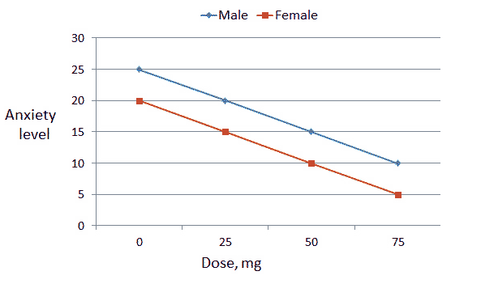

  
```{r setup, include=FALSE}
knitr::opts_chunk$set(echo = TRUE,fig.width=6, fig.height=5)
library(tidyverse)
library(knitr)
library(Hmisc)
```


## Interaction
In some cases, the association between a predictor and the outcome may depend on a third variable, indicating an interaction term is needed. Consider a study of a drug designed to treat anxiety. Because of some gender differences in anxiety disorders, researchers have reason to wonder whether a new drug has the same effects in men and women.

## No Interaction



This plot illustrates a case in which the dose effects of the drug are the same in men and women, though it appears men in the study tended to have higher anxiety levels overall ("main effect" of gender - constant 5 unit difference in anxiety levels by gender across all doses).

## No Interaction


The model corresponding to this figure would look something like the following:

$$ y_i = \beta_0 + \beta_1 \text{MALE}_i + \beta_2 \text{dose}_i +\varepsilon_i  $$


## No Interaction


$$ y_i = \beta_0 + \beta_1 \text{MALE}_i + \beta_2 \text{dose}_i +\varepsilon_i  $$

In this model, $\text{MALE}_i$ takes value 0 for females and 1 for males.  The variable $\text{dose}_i$ takes the appropriate numeric value of the dose in mg (0, 25, 50, or 75).

{width=50%}

Based on the figure, what are the values of $(\beta_0, \beta_1, \beta_2)$?

## No Interaction

$$ y_i = \beta_0 + \beta_1 \text{MALE}_i + \beta_2 \text{dose}_i +\varepsilon_i  $$

In this model, the expected anxiety levels at each dose are given below.

| Gender | Dose | Expected anxiety level|
|-------|-------|--------|
| Female | 0 | $\beta_0$ |
| Female | 25 | $\beta_0 + 25\beta_2$ |
| Female | 50 | $\beta_0 + 50\beta_2$ |
| Female | 75 | $\beta_0 + 75\beta_2$ |
| Male | 0 | $\beta_0+\beta_1$ |
| Male | 25 | $\beta_0+\beta_1+25\beta_2$ |
| Male | 50 | $\beta_0+\beta_1+50\beta_2$ |
| Male | 75 | $\beta_0+\beta_1+75\beta_2$ |


## Interaction


Here we have interaction between gender and dose -- the drug appears to be more effective at reducing anxiety in women. There is also a "main effect" of gender (men have higher anxiety levels even at dose 0).

## Interaction


When we have an interaction in a model, the "effect" of one variable depends on the level of another. In this case, the dose effect of the drug is different for men and for women. The corresponding model would be similar to that below.

$$ y_i = \beta_0 + \beta_1 \text{MALE}_i + \beta_2 \text{dose}_i + \beta_3\text{MALE}_i\text{dose}_i+\varepsilon_i  $$


## Interaction

$$ y_i = \beta_0 + \beta_1 \text{MALE}_i + \beta_2 \text{dose}_i + \beta_3\text{MALE}_i\text{dose}_i+\varepsilon_i  $$

In this model, the expected anxiety levels at each dose are given below.

| Gender | Dose | Expected anxiety level|
|-------|-------|--------|
| Female | 0 | $\beta_0$ |
| Female | 25 | $\beta_0 + 25\beta_2$ |
| Female | 50 | $\beta_0 + 50\beta_2$ |
| Female | 75 | $\beta_0 + 75\beta_2$ |
| Male | 0 | $\beta_0+\beta_1$ |
| Male | 25 | $\beta_0+\beta_1+25(\beta_2+\beta_3)$ |
| Male | 50 | $\beta_0+\beta_1+50(\beta_2+\beta_3)$ |
| Male | 75 | $\beta_0+\beta_1+75(\beta_2+\beta_3)$ |


##

Let's see if the gender-birth weight relationship is constant over gestational age.

$$ y_i = \beta_0 + \beta_1 \text{GEST}_i + \beta_2 \text{male}_i + \beta_3 \text{GEST}_i\text{male_i}+\epsilon_i  $$

* What is the slope for males? Females?
* How do you determine if gender is related to birth weight?  If gestational age is related to birth weight?

## Interaction code

```{r readdata}
o_data <- read.csv("~/Documents/TEACHING/vitalstats/Yr1117birth.csv", 
  na.strings=c("9","99", "9999"))
#SEX=1 male, 2 female
o_data$SEX=factor(o_data$SEX, levels=c(1,2),labels=c("Male","Female")) 

o_data$GEST_C=o_data$GEST; o_data$BWTG_C=o_data$BWTG
o_data$GEST_C[o_data$GEST_C>50]=NA
o_data$GEST_C[o_data$GEST_C<20]=NA
o_data$BWTG_C[o_data$BWTG_C<500]=NA
o_data$GEST_C[o_data$GEST_C<25 & o_data$BWTG_C>2000]=NA 
# now center gestational age at typical value of 39 weeks 
o_data$GEST_CENT=o_data$GEST_C-39 
# unrealistically young and heavy - a sloppy fix and you can do better!
birth_data <- na.omit(o_data)
birth_data$SEX <- relevel(birth_data$SEX, ref = "Female") 
#make females the referent group

```

##

```{r intmodel}
model2 = lm(BWTG_C~GEST_C+SEX+GEST_C*SEX, data=birth_data)
summary(model2)
```


## Parameter Interpretation 

This model is a little complicated to interpret -- the intercept of -4099 represents the expected birth weight of a baby at 0 weeks of gestation (clear example of why we do not extrapolate outside the range of the data!). The main effect of gender tells us that male babies weigh less than females at 0 weeks of gestation (equally not useful, and also a good example of why we cannot extrapolate beyond the range of the data!).

<br>

Usually when we have complex terms like interactions or polynomials in a model, it's easier to illustrate model results graphically.

## Graphical Interpretation

Let's pull off the appropriate parameter estimates from the interaction model so we can plot the model-estimated lines for male and female infants.

```{r pickoffestimates}
female_intercept <- model2$coefficients["(Intercept)"]
male_intercept <- model2$coefficients["(Intercept)"] +  model2$coefficients["SEXMale"]
female_slope <- model2$coefficients["GEST_C"]
male_slope <- model2$coefficients["GEST_C"] +  model2$coefficients["GEST_C:SEXMale"]
est2 <- data.frame(sl = c(female_slope,male_slope), 
                 int = c(female_intercept,male_intercept), 
                 SEX = c('Female','Male'))
est2
```


##

```{r makeplot, out.width="50%"}
# Plot some of the observed values and the predictions, sampling from original data 
# (so ggplot doesn't run super slowly)
N <- 100000 # how many points from original data set to plot
birth_data_red <- birth_data[sample(1:nrow(birth_data),N),]
library(ggplot2)
# Note the bottom left -- we systematically under-predict for very young babies.
ggplot(birth_data_red, aes(x=GEST_C,y=BWTG_C,color=SEX)) + geom_point(alpha=0.1) + 
  geom_abline(data=est2, aes(intercept=int, slope=sl, color=SEX)) +
  xlab("Gestational age (weeks)") + ylab("Birthweight (g)") + 
  ggtitle("Observed values with overlaid model predictions")
```

## Centering

You might not like the big negative intercept in the previous model. One way to make the intercept have a realistic interpretation on its own is to use centered variables -- for example we created a version of gestational age pseudo-centered 39 weeks. We'll get the same plot but more interpretable estimates in a model using a centered predictor.

##

```{r centeredmodel}
model3 = lm(BWTG_C~GEST_CENT+SEX+GEST_CENT*SEX, data=birth_data)
summary(model3)

```

This output is much easier to understand! The intercept now represents the expected birth weight at 39 weeks of a female infant.

##


```{r pickoffestimatescent}
female_intercept3 <- model3$coefficients["(Intercept)"]
male_intercept3 <- model3$coefficients["(Intercept)"] +  model3$coefficients["SEXMale"]
female_slope3 <- model3$coefficients["GEST_CENT"]
male_slope3 <- model3$coefficients["GEST_CENT"] +  model3$coefficients["GEST_CENT:SEXMale"]
est3 <- data.frame(sl = c(female_slope3,male_slope3), 
                 int = c(female_intercept3,male_intercept3), 
                 SEX = c('Female','Male'))
est3
```
Now you can easily see that at the typical (39 weeks) gestational age, the typical male baby is expected to weigh more than the typical female baby. Notice also the slopes are unaffected by the centering.

##
The estimates differ, but the plot and model fit are identical!

```{r makeplot3, out.width="45%"}
# Sample from from original data (so ggplot doesn't run super slowly)
# note plot a bit trickier to create as need to translate axis scales to
# get labels on the original scale
ggplot(birth_data_red, aes(x=GEST_CENT,y=BWTG_C,color=SEX)) + geom_point(alpha=0.1) + 
  geom_abline(data=est3, aes(intercept=int, slope=sl, color=SEX)) +
  labs(x=NULL)+
  scale_x_continuous(breaks=c(-14,-9,-4,1),labels=c("25","30","35","40"))+
  xlab("Gestational age (weeks)") + ylab("Birthweight (g)") + 
  ggtitle("Observed values with overlaid model predictions")

```


## Class Exercise:

1. Fit the interaction model switching the referent group from females to males, and verify the slopes and intercepts are the same for females and males.

2. Fit a regression model with birth weight as the outcome and predictors including biological sex, total pregnancies (dichotomized as 1 or >1), smoking status (dichotomized as any versus none), and gestational age (linear term in weeks). Explore whether interaction or polynomial terms improve model fit.


